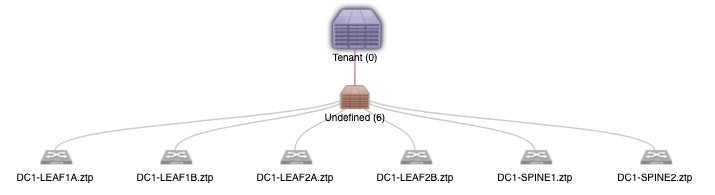

# ANSIBLE-CVP COOKIECUTTER

<!-- TOC -->

- [ANSIBLE-CVP COOKIECUTTER](#ansible-cvp-cookiecutter)
  - [Description](#description)
  - [Lab Topology](#lab-topology)
  - [Preparing the Lab](#preparing-the-lab)
  - [HOW TO RUN](#how-to-run)

<!-- /TOC -->

## Description

A [cokiecutter template](https://github.com/cookiecutter/cookiecutter)  to create an [Arista Ansible-CVP Lab](https://github.com/aristanetworks/ansible-cvp).

## Lab Topology

The lab topology used to test cookiecutter is shown below. It can be adjusted if required.


The lab must be created before using cookiecutter using EVE-NG, GNS3, KVM or similar.

All VMs in the lab should have access to a shared OOB network with a linux machine used to provide DHCP service and to route packets to CVP.

## Preparing the Lab

Before using the cookiecutter the switches in the lab must be registered on CVP as part of ZTP process.

To accomplish that a DHCP server has to be configured in the OOB network and provide the URL to ZTP script as option 67 (bootfile name).

To install dhcpd run following commands (Ubuntu):

```console
sudo apt install isc-dhcp-server
sudo vi /etc/dhcp/dhcpd.conf
systemctl enable isc-dhcp-server
systemctl start isc-dhcp-server
```

dhcpd.conf example:

```text
#
# DHCP Server Configuration file.
#   see /usr/share/doc/dhcp*/dhcpd.conf.example
#   see dhcpd.conf(5) man page
#

subnet 192.168.122.0 netmask 255.255.255.0 {
  range 192.168.122.11 192.168.122.29;
  option subnet-mask 255.255.255.0;
  option domain-name "ztp";
  option routers 192.168.122.1;
  interface virbr0;
  option bootfile-name "http://192.168.122.122/ztp/bootstrap";
}

host S1 {
  hardware ethernet 00:0c:29:78:01:00;
  fixed-address 192.168.122.11;
}

host S2 {
  hardware ethernet 00:0c:29:78:02:00;
  fixed-address 192.168.122.12;
}

host L1 {
  hardware ethernet 00:0c:29:78:11:00;
  fixed-address 192.168.122.21;
}

host L2 {
  hardware ethernet 00:0c:29:78:12:00;
  fixed-address 192.168.122.22;
}

host L3 {
  hardware ethernet 00:0c:29:78:13:00;
  fixed-address 192.168.122.23;
}

host L4 {
  hardware ethernet 00:0c:29:78:14:00;
  fixed-address 192.168.122.24;
}
```

All devices should register in Undefined container before you start:


## HOW TO RUN

```console
python3 -m venv .ccvenv
source .ccvenv/bin/activate
pip install cookiecutter
cookiecutter gh:ankudinov-labs-and-demos/ansible-cvp-cookiecutter
```
